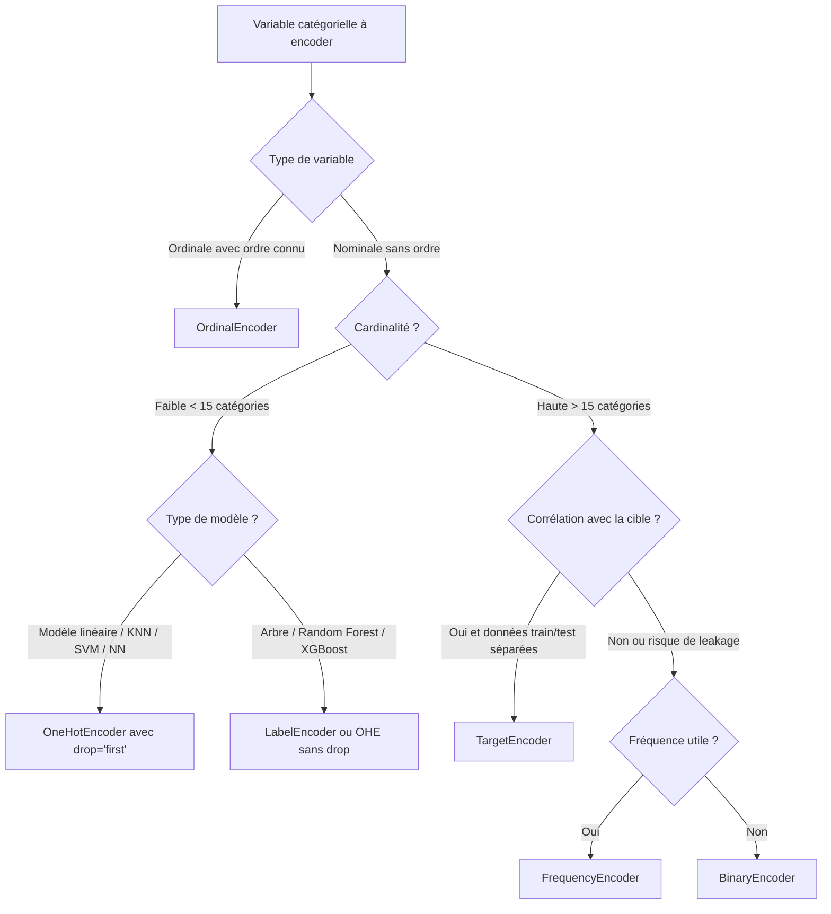

# 🔤 Guide des Encodeurs : Traiter les Variables Catégorielles en ML

Les modèles de Machine Learning ne comprennent que les **nombres**. Or, vos données contiennent souvent des colonnes textuelles comme *"Paris", "Lyon", "Bordeaux"* ou *"Rouge", "Vert", "Bleu"*. Les **encodeurs** permettent de convertir ces catégories en nombres. Mais comment choisir le bon ?

---

## 🧩 Pourquoi encoder ? Le problème des données catégorielles

```
DataFrame brut :
┌──────────┬─────────┬────────┐
│  Ville   │ Couleur │  Age   │
├──────────┼─────────┼────────┤
│  Paris   │  Rouge  │  25    │
│  Lyon    │  Bleu   │  30    │
│ Bordeaux │  Rouge  │  22    │
└──────────┴─────────┴────────┘
         ↓ Encodage nécessaire
┌────┬────┬────┬────────┬────┐
│ P  │ L  │ B  │Couleur │Age │
├────┼────┼────┼────────┼────┤
│ 1  │ 0  │ 0  │   1    │ 25 │
│ 0  │ 1  │ 0  │   0    │ 30 │
│ 0  │ 0  │ 1  │   1    │ 22 │
└────┴────┴────┴────────┴────┘
   Modèle ML peut maintenant lire ces données ✅
```

Il existe deux grands types de variables catégorielles :

| Type | Description | Exemple |
|---|---|---|
| **Nominale** | Catégories **sans ordre** | Ville, Couleur, Sexe |
| **Ordinale** | Catégories **avec un ordre** | Petit < Moyen < Grand, Note A > B > C |

Le choix de l'encodeur dépend du **type de variable** et du **modèle utilisé**.

---

## 1. 🏷️ Label Encoding (Encodage par Label)

### Principe
Remplace chaque catégorie par un **entier unique** : `0, 1, 2, 3…`

```
Paris    → 0
Lyon     → 1
Bordeaux → 2
```

### Schéma
```
Avant : ["Paris", "Lyon", "Paris", "Bordeaux"]
Après : [  0    ,   1   ,    0  ,     2     ]
```

### ✅ Quand l'utiliser ?
- Variables **ordinales** (il y a un ordre logique) : ex. `Petit=0, Moyen=1, Grand=2`
- Avec des **arbres de décision, Random Forest, XGBoost** qui n'interprètent pas de relation d'ordre numérique entre les catégories
- Pour encoder la colonne **cible (y)** en classification

### ❌ Quand l'éviter ?
- Variables **nominales** (sans ordre) avec des modèles linéaires ou KNN : le modèle interprétera `Paris=0 < Lyon=1 < Bordeaux=2` comme s'il y avait un ordre réel, ce qui est **faux et trompeur** !

```python
from sklearn.preprocessing import LabelEncoder

le = LabelEncoder()
df["Ville_encoded"] = le.fit_transform(df["Ville"])

# Voir la correspondance catégorie → entier
print(dict(zip(le.classes_, le.transform(le.classes_))))
# → {'Bordeaux': 0, 'Lyon': 1, 'Paris': 2}
```

---

## 2. 🔢 Ordinal Encoding (Encodage Ordinal)

### Principe
Identique au Label Encoding, mais vous **spécifiez vous-même l'ordre** des catégories. C'est la version "intelligente" du Label Encoding pour les variables ordinales.

### Schéma
```
Ordre défini : ["Petit", "Moyen", "Grand", "Très Grand"]
Résultat     : [   0   ,    1   ,    2   ,      3      ]
```

### ✅ Quand l'utiliser ?
- Variables **ordinales avec un ordre clair et connu** : Niveau d'éducation, Taille de t-shirt, Note de satisfaction (Mauvais/Moyen/Bon/Excellent)
- Avec **tous types de modèles** (car l'ordre est sémantiquement correct)

```python
from sklearn.preprocessing import OrdinalEncoder

# Définir l'ordre des catégories manuellement
encoder = OrdinalEncoder(categories=[["Petit", "Moyen", "Grand", "Très Grand"]])
df[["Taille_encoded"]] = encoder.fit_transform(df[["Taille"]])

# Résultat :
# Petit → 0, Moyen → 1, Grand → 2, Très Grand → 3
```

---

## 3. 🔳 One-Hot Encoding (OHE)

### Principe
Crée une **nouvelle colonne binaire (0 ou 1) pour chaque catégorie**. Une seule colonne vaut 1 à la fois ("one hot").

### Schéma
```
Colonne originale "Ville" :
┌──────────┐     ┌───────────┬──────────┬──────────────┐
│  Ville   │  →  │ Ville_Paris│ Ville_Lyon│ Ville_Bordeaux│
├──────────┤     ├───────────┼──────────┼──────────────┤
│  Paris   │     │     1     │    0     │      0       │
│  Lyon    │     │     0     │    1     │      0       │
│ Bordeaux │     │     0     │    0     │      1       │
└──────────┘     └───────────┴──────────┴──────────────┘
```

### ✅ Quand l'utiliser ?
- Variables **nominales** (sans ordre) : Couleur, Pays, Type de produit
- Avec des modèles **linéaires** (Régression Linéaire, Logistique, SVM, KNN, Réseaux de Neurones)
- Quand le nombre de catégories est **faible à modéré** (< 10-15 catégories)

### ❌ Quand l'éviter ?
- Quand il y a **beaucoup de catégories** (ex: 500 villes) → crée des centaines de colonnes (**curse of dimensionality**)
- Avec des **arbres de décision et Random Forest** : inutile, le Label Encoding suffit

> 💡 **Astuce : `drop='first'`** — Pour éviter la **multicolinéarité** (phénomène où une colonne est devinée depuis les autres) avec les modèles linéaires, supprimez la première colonne. Si `Ville_Paris=0` et `Ville_Lyon=0`, on sait forcément que c'est Bordeaux.
>
> ⚠️ N'utilisez **pas** `drop='first'` avec des arbres de décision, Random Forest, XGBoost.

```python
from sklearn.preprocessing import OneHotEncoder
import pandas as pd

# Avec scikit-learn
ohe = OneHotEncoder(sparse_output=False, drop='first')  # drop='first' pour les modèles linéaires
encoded = ohe.fit_transform(df[["Ville"]])
encoded_df = pd.DataFrame(encoded, columns=ohe.get_feature_names_out(["Ville"]))

# Alternative avec pandas (plus simple pour l'exploration)
encoded_df = pd.get_dummies(df, columns=["Ville"], drop_first=True)
```

---

## 4. 🔢 Target Encoding (Encodage par la Cible)

### Principe
Remplace chaque catégorie par la **moyenne de la variable cible** pour cette catégorie. Ex: si les appartements à Paris se vendent en moyenne à 400 000€, Paris → 400 000.

### Schéma
```
Dataset :
Ville    | Prix
Paris    | 500k
Paris    | 300k
Lyon     | 250k
Lyon     | 200k

→ Target Encoding :
Paris    → (500k + 300k) / 2 = 400k
Lyon     → (250k + 200k) / 2 = 225k
```

### ✅ Quand l'utiliser ?
- Variables nominales avec **énormément de catégories** (haute cardinalité) : ID client, Code postal, Nom de produit
- Principalement avec des **modèles d'arbres** (XGBoost, Random Forest)
- En compétition Kaggle, très souvent combiné avec du boosting

### ❌ Risque majeur : Le Data Leakage !
- Le Target Encoding peut introduire du **data leakage** (fuite d'information de la cible vers les features) si mal appliqué. Il faut **toujours** l'entraîner **uniquement sur le train set** et l'appliquer ensuite au test set.

```python
# Méthode manuelle (simple mais risque de leakage sans précaution)
target_mean = df.groupby("Ville")["Prix"].mean()
df["Ville_target_encoded"] = df["Ville"].map(target_mean)

# Méthode robuste avec scikit-learn (gère automatiquement le leakage via CV)
from sklearn.preprocessing import TargetEncoder

te = TargetEncoder(smooth="auto")
df["Ville_encoded"] = te.fit_transform(df[["Ville"]], df["Prix"])
```

---

## 5. 🔐 Binary Encoding

### Principe
Convertit d'abord la catégorie en un entier (comme le Label Encoding), puis encode cet entier en **binaire**. La représentation binaire est ensuite éclatée en colonnes.

### Schéma
```
Paris    → 1 → 001
Lyon     → 2 → 010
Bordeaux → 3 → 011
Marseille→ 4 → 100
Toulouse → 5 → 101

→ 3 colonnes binaires au lieu de 5 colonnes OHE
```

### ✅ Quand l'utiliser ?
- Variables nominales avec une **cardinalité moyenne à haute** (entre 15 et 100 catégories environ)
- Quand le OHE crée trop de colonnes mais que le Target Encoding est risqué

```python
# pip install category_encoders
import category_encoders as ce

be = ce.BinaryEncoder(cols=["Ville"])
df_encoded = be.fit_transform(df)
```

---

## 6. 📊 Frequency Encoding (Encodage par Fréquence)

### Principe
Remplace chaque catégorie par sa **fréquence d'apparition** dans le dataset (le nombre ou le pourcentage de fois où elle apparaît).

### Schéma
```
Dataset : [Paris, Paris, Lyon, Paris, Bordeaux, Lyon]
Paris    apparaît 3 fois → 3/6 = 0.50
Lyon     apparaît 2 fois → 2/6 = 0.33
Bordeaux apparaît 1 fois → 1/6 = 0.17
```

### ✅ Quand l'utiliser ?
- Variables avec **haute cardinalité** quand la fréquence d'apparition est une information utile
- Cas typiques : détection de fraude (des IPs rares peuvent être suspectes), analyse de logs
- Avec des **modèles d'arbres**

```python
freq = df["Ville"].value_counts(normalize=True)  # normalize=True → proportions
df["Ville_freq"] = df["Ville"].map(freq)
```

---

## 🗺️ Récapitulatif : Quel Encodeur Choisir ?



| Encodeur | Nominale | Ordinale | Haute cardinalité | Modèles linéaires | Modèles arbres | Risque |
|---|---|---|---|---|---|---|
| **LabelEncoder** | ⚠️ Avec précaution | ✅ | ✅ | ❌ | ✅ | Faux ordre pour modèles linéaires |
| **OrdinalEncoder** | ❌ | ✅ | ✅ | ✅ | ✅ | Ordre doit être correct |
| **OneHotEncoder** | ✅ | ❌ | ❌ | ✅ | ✅ Mais inutile | Explosion du nb de colonnes |
| **TargetEncoder** | ✅ | ❌ | ✅ | ✅ | ✅ | Data leakage si mal utilisé |
| **BinaryEncoder** | ✅ | ❌ | ✅ | ⚠️ | ✅ | Moins interprétable |
| **FrequencyEncoder** | ✅ | ❌ | ✅ | ⚠️ | ✅ | Perd la distinction entre catégories rares |

---

## 💡 Bonnes Pratiques

### 1. Toujours utiliser un Pipeline pour éviter le Data Leakage

```python
from sklearn.pipeline import Pipeline
from sklearn.compose import ColumnTransformer
from sklearn.preprocessing import OneHotEncoder, OrdinalEncoder, StandardScaler
from sklearn.ensemble import RandomForestClassifier

# Définir les colonnes par type d'encodage
nominal_cols  = ["Ville", "Couleur"]
ordinal_cols  = ["Taille"]
numeric_cols  = ["Age", "Salaire"]

preprocessor = ColumnTransformer(transformers=[
    ("ohe",     OneHotEncoder(drop='first', handle_unknown='ignore'), nominal_cols),
    ("ordinal", OrdinalEncoder(categories=[["Petit", "Moyen", "Grand"]]),  ordinal_cols),
    ("num",     StandardScaler(),                                            numeric_cols),
])

pipeline = Pipeline(steps=[
    ("preprocessor", preprocessor),
    ("model",        RandomForestClassifier(n_estimators=100, random_state=42))
])

pipeline.fit(X_train, y_train)
print(f"Score : {pipeline.score(X_test, y_test):.2%}")
```

### 2. Gérer les catégories inconnues au moment de la prédiction

```python
# handle_unknown='ignore' → les nouvelles catégories au test donnent un vecteur de 0
ohe = OneHotEncoder(handle_unknown='ignore')

# handle_unknown='use_encoded_value' + unknown_value=-1 → catégorie "inconnue" = -1
oe = OrdinalEncoder(handle_unknown='use_encoded_value', unknown_value=-1)
```

### 3. Règle d'or : Fit sur le train, Transform sur le test

```python
# ✅ Correct
encoder.fit(X_train[["Ville"]])          # Apprend les catégories sur le train
X_train_enc = encoder.transform(X_train[["Ville"]])  # Transforme le train
X_test_enc  = encoder.transform(X_test[["Ville"]])   # Applique la même transformation au test

# ❌ Incorrect (data leakage !)
encoder.fit_transform(X[["Ville"]])  # Ne jamais fit sur l'intégralité des données
```
