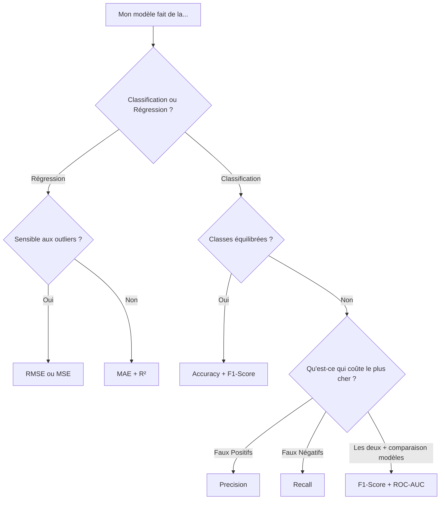

# 📊 Guide des Métriques d'Évaluation en Machine Learning

Ce document explique les principales métriques utilisées pour évaluer les performances d'un modèle de Machine Learning. Savoir **quelle métrique choisir** est aussi important que de choisir le bon modèle.

---

## 🧩 Comprendre la Matrice de Confusion (la base de tout)

Avant toute chose, il faut comprendre la **Matrice de Confusion**. Elle résume les prédictions d'un modèle de classification sur 4 cases :

```
                    Prédiction du Modèle
                    ┌─────────────┬─────────────┐
                    │  Positif    │  Négatif    │
         ┌──────────┼─────────────┼─────────────┤
Réalité  │ Positif  │ TP ✅       │ FN ❌       │
         │ Négatif  │ FP ❌       │ TN ✅       │
         └──────────┴─────────────┴─────────────┘

TP (True Positive)  : Le modèle prédit Positif  → c'est bien Positif  ✅
TN (True Negative)  : Le modèle prédit Négatif  → c'est bien Négatif  ✅
FP (False Positive) : Le modèle prédit Positif  → mais c'est Négatif  ❌ (Fausse Alarme)
FN (False Negative) : Le modèle prédit Négatif  → mais c'est Positif  ❌ (Raté)
```

```python
from sklearn.metrics import confusion_matrix, ConfusionMatrixDisplay
import matplotlib.pyplot as plt

cm = confusion_matrix(y_test, y_pred)
disp = ConfusionMatrixDisplay(confusion_matrix=cm, display_labels=["Négatif", "Positif"])
disp.plot()
plt.title("Matrice de Confusion")
plt.show()
```

> Toutes les métriques ci-dessous se calculent à partir de ces 4 valeurs : **TP, TN, FP, FN**.

---

## 1. 🎯 Accuracy (Exactitude)

### Formule
```
Accuracy = (TP + TN) / (TP + TN + FP + FN)
```

### Ce que ça mesure
Le **pourcentage global de bonnes prédictions** (toutes classes confondues).

### Exemple
Sur 100 patients : 90 bien classés → Accuracy = **90%**

### ✅ Quand l'utiliser ?
- Quand les classes sont **équilibrées** (environ le même nombre d'exemples par classe)
- Comme **première métrique rapide** pour avoir une idée globale des performances

### ❌ Quand l'éviter ?
- Quand les classes sont **déséquilibrées**

> ⚠️ **Le piège classique :** Si votre dataset contient 95% de "non-fraude" et 5% de "fraude", un modèle qui prédit toujours "non-fraude" aurait **95% d'accuracy**... sans jamais avoir détecté une seule fraude ! L'accuracy devient alors totalement inutile.

```python
from sklearn.metrics import accuracy_score
print(f"Accuracy : {accuracy_score(y_test, y_pred):.2%}")
```

---

## 2. 🔍 Précision (Precision)

### Formule
```
Precision = TP / (TP + FP)
```

### Ce que ça mesure
Parmi tous les cas que le modèle a prédit comme **Positifs**, combien l'étaient **vraiment** ?

→ **"Quand le modèle dit OUI, a-t-il raison ?"**

### Exemple concret
Le modèle détecte 50 emails comme "Spam". En réalité, 45 sont bien des spams et 5 ne le sont pas.
→ Precision = 45 / 50 = **90%**

### ✅ Quand l'utiliser ?
- Quand un **Faux Positif (FP) est coûteux ou gênant**
- Exemples :
  - Filtre anti-spam (un email important classé comme spam est embêtant)
  - Publicité ciblée (contacter quelqu'un qui n'est pas intéressé = coût publicitaire inutile)
  - Recommandations produit (recommander quelque chose qui ne plaît pas = mauvaise expérience)

```python
from sklearn.metrics import precision_score
print(f"Precision : {precision_score(y_test, y_pred):.2%}")
```

---

## 3. 📡 Recall (Rappel / Sensibilité)

### Formule
```
Recall = TP / (TP + FN)
```

### Ce que ça mesure
Parmi tous les cas **vraiment Positifs**, combien le modèle en a-t-il **détectés** ?

→ **"Le modèle rate-t-il des cas positifs ?"**

### Exemple concret
Il y a 100 patients malades dans l'hôpital. Le modèle en détecte 80.
→ Recall = 80 / 100 = **80%** (20 malades ont été manqués !)

### ✅ Quand l'utiliser ?
- Quand un **Faux Négatif (FN) est très coûteux** (rater un cas positif est dangereux)
- Exemples :
  - Diagnostic médical (rater un cancer = catastrophique)
  - Détection de fraude bancaire (rater une fraude = perte d'argent)
  - Détection d'intrusion réseau (rater une attaque = désastre sécuritaire)

```python
from sklearn.metrics import recall_score
print(f"Recall : {recall_score(y_test, y_pred):.2%}")
```

---

## 4. ⚖️ F1-Score

### Formule
```
F1-Score = 2 × (Precision × Recall) / (Precision + Recall)
```

### Ce que ça mesure
La **moyenne harmonique** de la Précision et du Recall. C'est un **compromis équilibré** entre les deux.

### Schéma : Le dilemme Precision/Recall
```
Augmenter la Precision → Diminue le Recall  (le modèle est plus "sélectif")
Augmenter le Recall   → Diminue la Precision (le modèle est plus "généreux")

     Precision 100%  ─────────────────────  Recall 100%
              ↑ Trop stricte          Trop laxiste ↑
                          ↑ F1-Score
                      Compromis optimal
```

### Exemple
- Precision = 90%, Recall = 50% → F1 = 2 × (0.9 × 0.5) / (0.9 + 0.5) = **64.3%**
- Precision = 75%, Recall = 75% → F1 = **75%** (bien meilleur, plus équilibré !)

### ✅ Quand l'utiliser ?
- Quand les classes sont **déséquilibrées**
- Quand vous voulez un **seul score** pour évaluer le compromis Precision/Recall
- Quand les deux types d'erreurs (FP et FN) ont une importance comparable
- Très utilisé en **NLP, détection de fraude, médecine**

```python
from sklearn.metrics import f1_score, classification_report

# F1-Score binaire
print(f"F1-Score : {f1_score(y_test, y_pred):.2%}")

# Rapport complet (Precision + Recall + F1 pour chaque classe)
print(classification_report(y_test, y_pred, target_names=["Classe 0", "Classe 1"]))
```

> 💡 **Variante : F-beta Score** — Si vous voulez pondérer l'un sur l'autre :
> - `beta < 1` → favorise la Precision
> - `beta > 1` → favorise le Recall
> ```python
> from sklearn.metrics import fbeta_score
> print(fbeta_score(y_test, y_pred, beta=2))  # Favorise le Recall (x2)
> ```

---

## 5. 📈 ROC-AUC (Area Under the Curve)

### Ce que ça mesure
La courbe **ROC (Receiver Operating Characteristic)** trace le Recall (axe Y) en fonction du Taux de Faux Positifs (axe X) pour **tous les seuils de décision possibles**. L'**AUC** est l'aire sous cette courbe.

```
Recall (Taux VP)
1.0 │    ╭──────────────  Modèle parfait (AUC=1.0)
    │   /─────────────── Bon modèle (AUC~0.85)
    │  /  ╱
0.5 │ / ╱
    │/╱ ──────────────── Modèle aléatoire (AUC=0.5, diagonale)
0.0 └─────────────────── Taux de FP
    0.0                1.0
```

| Valeur AUC | Interprétation |
|---|---|
| **1.0** | Modèle parfait (impossible en pratique) |
| **> 0.9** | Excellent |
| **0.8 – 0.9** | Très bon |
| **0.7 – 0.8** | Bon |
| **0.5 – 0.7** | Moyen |
| **= 0.5** | Modèle aléatoire (inutile) |
| **< 0.5** | Pire que le hasard ! |

### ✅ Quand l'utiliser ?
- Quand vous voulez évaluer le modèle **indépendamment du seuil de décision**
- Quand les classes sont **déséquilibrées**
- Pour **comparer plusieurs modèles** entre eux rapidement
- En scoring (ex: scoring crédit, où le seuil change selon le contexte)

```python
from sklearn.metrics import roc_auc_score, roc_curve
import matplotlib.pyplot as plt

# Le modèle doit être capable de retourner des probabilités (predict_proba)
y_proba = model.predict_proba(X_test)[:, 1]

auc = roc_auc_score(y_test, y_proba)
print(f"ROC-AUC : {auc:.4f}")

# Tracer la courbe ROC
fpr, tpr, thresholds = roc_curve(y_test, y_proba)
plt.plot(fpr, tpr, label=f"AUC = {auc:.2f}")
plt.plot([0, 1], [0, 1], 'k--', label="Aléatoire")
plt.xlabel("Taux de Faux Positifs")
plt.ylabel("Recall (Taux de Vrais Positifs)")
plt.title("Courbe ROC")
plt.legend()
plt.show()
```

---

## 6. 📉 Métriques de Régression

Ces métriques s'appliquent quand on prédit une **valeur continue** (prix, température, durée...).

### MAE — Mean Absolute Error (Erreur Absolue Moyenne)
```
MAE = (1/n) × Σ |y_réel - ŷ_prédit|
```
→ Moyenne des erreurs absolues. **Facile à interpréter** (même unité que la cible).

### MSE — Mean Squared Error (Erreur Quadratique Moyenne)
```
MSE = (1/n) × Σ (y_réel - ŷ_prédit)²
```
→ Pénalise fortement les **grosses erreurs** (les erreurs sont au carré).

### RMSE — Root Mean Squared Error
```
RMSE = √MSE
```
→ Même unité que la cible. **Plus parlant que le MSE**, et pénalise toujours les grosses erreurs.

### R² Score (Coefficient de Détermination)
```
R² = 1 - (SS_res / SS_tot)
```
→ Mesure la **proportion de variance expliquée** par le modèle.
- `R² = 1.0` → Prédictions parfaites
- `R² = 0.0` → Aussi bien qu'une simple moyenne
- `R² < 0` → Pire que la moyenne (modèle inutile !)

| Métrique | Sensibilité aux outliers | Interprétabilité | Unité |
|---|---|---|---|
| MAE | Faible | ⭐⭐⭐⭐⭐ | Même que la cible |
| MSE | Forte | ⭐⭐ | Carré de la cible |
| RMSE | Forte | ⭐⭐⭐⭐ | Même que la cible |
| R² | Moyenne | ⭐⭐⭐⭐⭐ | Sans unité (0 à 1) |

```python
from sklearn.metrics import mean_absolute_error, mean_squared_error, r2_score
import numpy as np

mae = mean_absolute_error(y_test, y_pred)
mse = mean_squared_error(y_test, y_pred)
rmse = np.sqrt(mse)
r2 = r2_score(y_test, y_pred)

print(f"MAE  : {mae:.2f}")
print(f"MSE  : {mse:.2f}")
print(f"RMSE : {rmse:.2f}")
print(f"R²   : {r2:.4f}")
```

---

## 🗺️ Récapitulatif : Quelle Métrique Choisir ?



| Métrique | Type | Classes déséquilibrées | Priorité FP | Priorité FN | Cas d'usage typique |
|---|---|---|---|---|---|
| **Accuracy** | Classification | ❌ Éviter | - | - | Baseline rapide, classes équilibrées |
| **Precision** | Classification | ✅ | ✅ Oui | - | Anti-spam, recommandations |
| **Recall** | Classification | ✅ | - | ✅ Oui | Diagnostic médical, détection fraude |
| **F1-Score** | Classification | ✅ | ✅ | ✅ | NLP, détection d'anomalies |
| **ROC-AUC** | Classification | ✅ | - | - | Comparer des modèles, scoring |
| **MAE** | Régression | - | - | - | Prix, températures (robuste) |
| **RMSE** | Régression | - | - | - | Quand les grosses erreurs sont critiques |
| **R²** | Régression | - | - | - | Expliquer la qualité globale du modèle |
